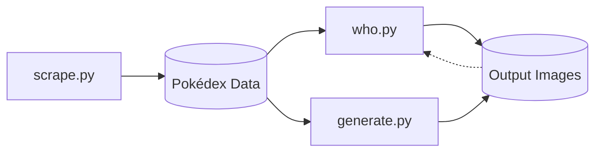
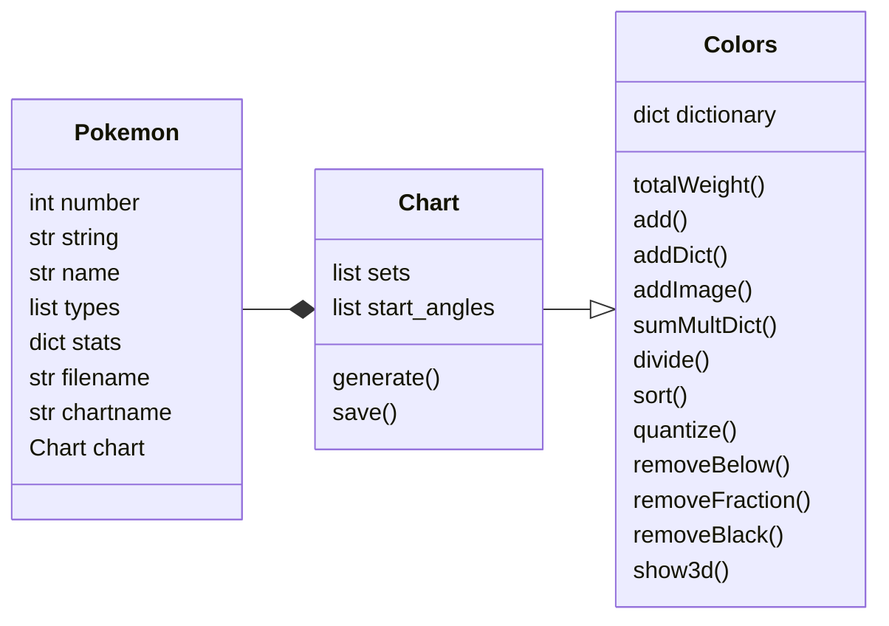
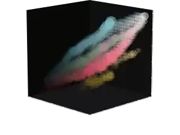
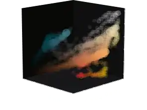
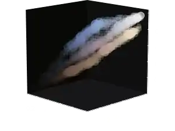

# PokéChart

PokéChart uses k-means grouping to make a simple, aesthetically pleasing chart which represents the primary colors in a Pokémon.

* Create a colorful chart that represents the main colors in an image
* Generate charts for Pokémon images and data downloaded from the internet
* Play 'Who's that Pokémon?' and connect the colorful charts to Pokémon you know and love


---

## Installation

1. Download the project from [GitHub](https://github.com/DevinBerchtold/PokeChart)
2. Install the required Python libraries:
    * [scikit-learn](https://scikit-learn.org/stable/)
    * [Pillow](https://pillow.readthedocs.io/en/stable/)
    * [Matplotlib](https://matplotlib.org/stable/index.html)
    * [NumPy](https://numpy.org/doc/stable/)
    * [Requests](https://docs.python-requests.org/en/latest/)

    If you install scikit-learn and Requests, they should pull in everything else:

    ```
    py -m pip install --upgrade sklearn
    py -m pip install --upgrade requests
    ```

3. Run [`scrape.py`](#scrapepy) to download input data

## Usage

### Download Pokédex Data

1. Change hardcoded constants to select which Pokémon to download (by Pokédex number).
2. Run [`scrape.py`](#scrapepy) to download Pokédex data.

### Generate Pokémon Charts

1. Select parameters by changing hardcoded constants. Make sure the Pokédex data has been downloaded for the Pokémon you want to generate
2. Run [`generate.py`](#generatepy)

### Play 'Who's That Pokémon?'

*Requires Pokédex data to be downloaded. Charts can be pregenerated or generated dynamically.*

1. Run [`who.py`](#whopy)

#### Details

<details>

<summary>(Click to expand)</summary>

**Syntax:**

```py who.py -n<first_pokemon>-<last_pokemon> -c<number_of_choices>```
```powershell
py who.py -n1-151 -c5
```
**Sample output:**
```
== Who's That Pokemon!?! ==
A: Pidgeot
B: Golbat
C: Gengar
D: Caterpie
E: Marowak
* Showing clue. Close to reveal answer *
```
")

---

```
== Gengar ==
It is said to emerge from darkness to steal the
lives of those who become lost in mountains.
```

")

</details>

---

## Main Files

`scrape.py` will download Pokédex data that is used by `generate.py` and `who.py`.



### `scrape.py`

Downloads Pokédex data from PokéAPI and Pokémon image data Serebii.net. Saves files locally for later use. ([Credits](#credits))

### `generate.py`

Generates circle charts for a list of pokemon. Creates composite images.

#### Generate Processing

1. Read in Pokédex data and verify that we have images.
2. If `SAVE_POKES`: Generate icon for each input Pokémon image. ([Chart Processing](#chart-processing))
4. If `SAVE_TYPES`: Generate icons for groups of Pokémon (all Pokémon of a certain type, etc.)
3. If `SAVE_SHEET`: Arrange individual and group icon images into one pretty composite image.

### `who.py`

Shuffles a list of Pokémon to create a multiple choice "Who's That Pokémon?" game.

---

## Classes



### `chart.py`

Defines `Color` which contains a weighted list of colors and functions to perform on the colors. Defines `Chart` which extends `Color` with functions to generate a color chart.

#### Color Analysis

The `show3d()` function allows you to view a representation of a `Color` object in 3d RGB space. This can be used to analyze the color data and determine if the grouping is a good fit.

| Venusaur | Charizard | Blastoise |
|:-:|:-:|:-:|
| [](image/animation_003.mp4) | [](image/animation_006.mp4) | [](image/animation_009.mp4) |
|  |  |  |

#### Chart Processing

1. Perform k-means clustering to find k colors which represent the image. Repeat for all values of k. ([Clustering Performance](#k-means-clustering))
2. For each clustering:
    1. Create a pie chart of the k colors where the size of each slice represents the weight of that color from the clustering
    2. Arrange layer n+1 such that it blends as best as possible with the previous layer
        1. Find all non-cyclic permutations of colors for layer n+1.
        2. Calculate a score for each permutation at every rotation (0°-360° at 1° increments) where the score represents the color contrast between layer n and n+1. ([Permutation Performance](#color-permutation-matching))
    3. Choose the lowest score and move on to pick the next layer
3. Write out completed chart after all layers are done.

### `pokemon.py`

Defines `Pokemon()` which describes a Pokémon and contains a `Chart()` to represent the Pokémon's colors and generate a chart.

---

## Performance

The time required to generate the image depends mostly on the k-means clustering (`Colors.groups()`) and color permutation matching (`Chart.sortPermutationMulti()`) functions. For low `k` (`k` < 5), the clustering will take the longest. For large `k` (`k` > 5), the permutation matching will take longer.

### k-Means Clustering

This calls `sklearn.cluster.MiniBatchKMeans()` to do all the work. It can be sped up a little by reducing the size of the input dataset, so the colors are quantized before clustering. Time increases (less than) linearly with `k`.

### Color Permutation Matching

We use a brute force method to calculate all possible arrangements of colors, score them, and pick the best. The scoring is highly parallel so we use `multiprocessing.Pool` to calculate scores with multiple threads. The number of permutations to be calculated scales with `(k-1)!` so this grows very quickly with high `k`.

This is very slow and makes the entire process O(n!). There has to be a better way.

---

## Todo

- [x] Color charts
- [ ] Mega Evolutions
- [ ] Optimize k-means performance
- [ ] Investigate other clustering algorithms
- [ ] Better color-matching algorithm

---

## Credits

Thanks to all the folks behind Python and the packages used in this project.

Pokédex data scraped from PokéAPI: [pokeapi.co](https://pokeapi.co/)

Images of Pokémon scraped from Serebii: [serebii.net](https://www.serebii.net/)

Pokémon art and characters are trademarks of Nintendo:

> © 2022 Pokémon. © 1995–2022 Nintendo/Creatures Inc./GAME FREAK inc. Pokémon, Pokémon character names, Nintendo Switch, Nintendo 3DS, Nintendo DS, Wii, Wii U, and WiiWare are trademarks of Nintendo. The YouTube logo is a trademark of Google Inc. Other trademarks are the property of their respective owners.

[Pokémon Legal Information](https://www.pokemon.com/us/legal/)

---

## License

This project is released under the MIT license:

[MIT License](https://choosealicense.com/licenses/mit/)